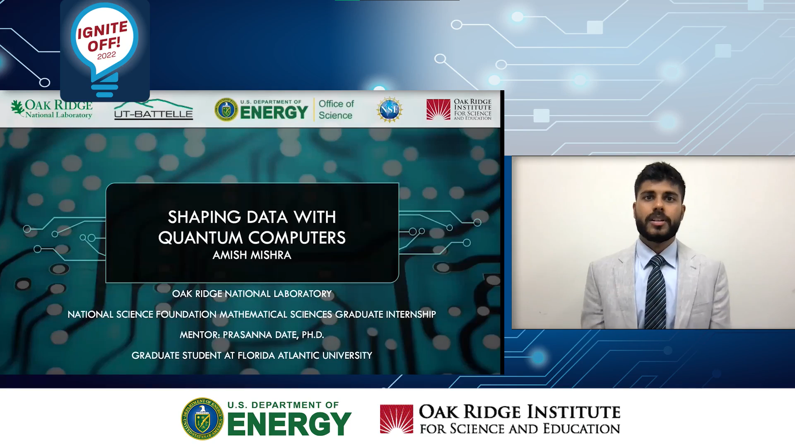
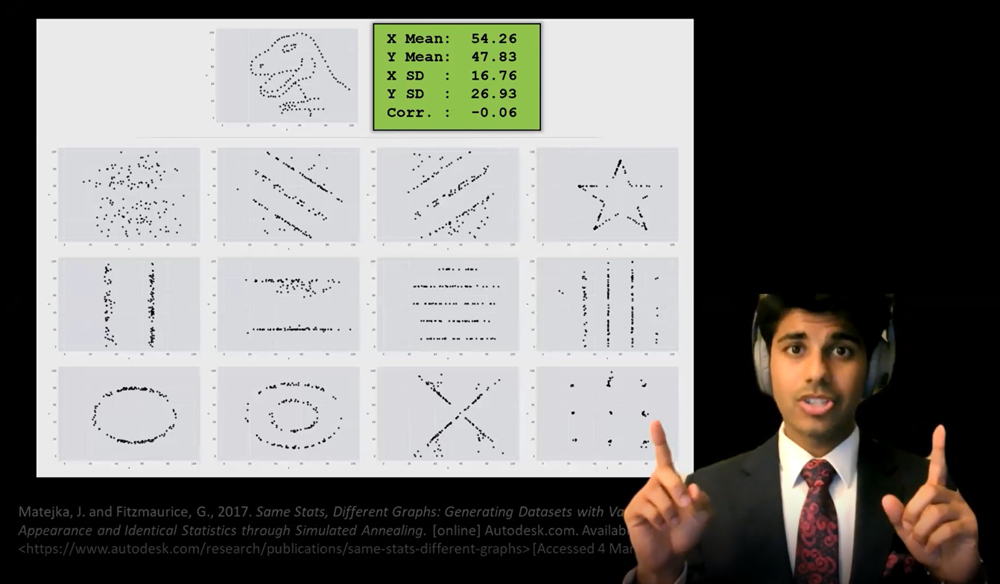

Hello, friends. Welcome to my website!

Here is the 2022 Ignite Off! National competition that I took 1st place in for my 5 minute presentation on my internship work at Oak Ridge National Laboratory.

* A related article written about the competition: [First all-ORISE Ignite Off Competition names ORNL intern as its winner](https://orise.orau.gov/news/archive/2022/first-all-orise-ignite-off-competition-names-ornl-intern-as-its-winner.html)

Also, check out this 3 minute video I made giving an overview of my research at FAU in 2022:

My projects are available on [Github](https://github.com/amish-mishra). They include:

- [Matrix-Chain Multiplication Problem](https://github.com/amish-mishra/matrix-chain-multiplication): solved and analyzed using a Brute-force approach and a Dynamic programming approach
- [The Delaunay-Rips Filtration](https://github.com/amish-mishra/cechmate_DR): A computationally efficient filtration for TDA
- [Interactive plot of solution to 1-D heat equation](https://github.com/amish-mishra/1d-heat-eqn)
